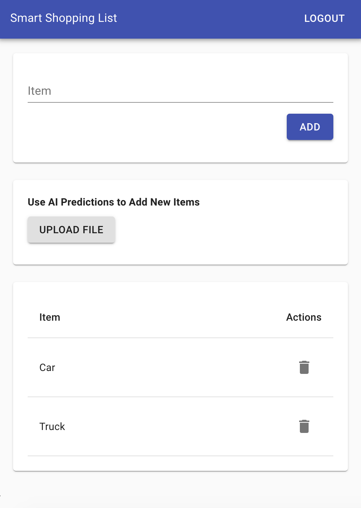
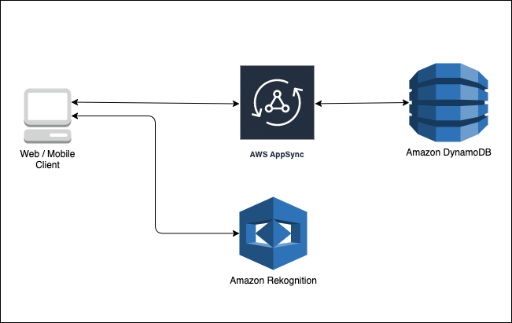

## What we are building

In this demo, we are building a we App that allows you to create a personal shopping list that can be accessd from the web. The list can be updated manually or by uploading an image from where the app can detect items that the user can quickly choose from to add to the list. The front end we will build in shown.




## Architecture 

The below diagram shows the architecture of the App - A react front-end app utilizes AppSync graphql server to create, read, delete items to a DynamoDB database. We also have an integration with Amazon Rekognition to detect objects in images that can be used as labels to create the shopping list items. 



## Get Started by cloning the repo

`git clone https://github.com/sathishc/shopping-list.git`


## Install the necessary npm packages

`npm install`

Now you will have a frontend that includes just the React front-end. We are using React-Material-UI components to style the front-end. This is just boiler plate code without any backend integrations into AWS. In the repo, you fill find the files 'predictions.js' and 'db.js' under src/api folders. We will add code here after deploying the necessary backends using Amplify 

Run `npm start` to see the UI frontend

## Install Amplify CLI, Initialize the project and add necessary libraries

**Install the Amplify CLI globally**

`npm install -g @aws-amplify/cli`


**Initialize Amplify in the project from the root folder**

`amplify init`

**Follow the steps below for inputs**

```

? Enter a name for the project shopping-list
? Enter a name for the environment dev
? Choose your default editor: vscode
? Choose the type of app that you are building: javascript

Please tell us about your project

? What javascript framework are you using: react
? Source Directory Path:  src
? Distribution Directory Path: build
? Build Command:  npm run-script build
? Start Command: npm run-script start

Using default provider  awscloudformation

For more information on AWS Profiles, see:
https://docs.aws.amazon.com/cli/latest/userguide/cli-configure-profiles.html

? Do you want to use an AWS profile? Yes
? Please choose the profile you want to use default

```

**Install Amplify javascript libraries needed from within the root folder of the repository**

`npm install --save aws-amplify@3.3.14 @aws-amplify/ui-react@0.2.34`

## Add Authentication

**Add authentication backend to the app using the command**

`amplify add auth`

**Follow the steps below for inputs**

```
Select Default Configuration when asked if you'd like to use the default authentication and security configuration.
   
Select Username when asked how you want users to sign in.
   
Select "No, I am done." when asked about advanced settings.

Run `amplify push` and confirm with a 'Yes' to create these changes in the cloud.

Confirm you want Amplify to make changes in the cloud for you.
```

Wait for the provisioning to complete. This will take a few minutes. The above steps creates an Authentication backend provider using Cognito user and identity pools and connects that with the Amplify project.

**Add authentication front-end**

Open the file index.js and add the below line to import the AmplifyAuthenticator component

`import { AmplifyAuthenticator } from '@aws-amplify/ui-react';`

Replace the `<App />` component in the same file with `<AmplifyAuthenticator><App /></AmplifyAuthenticator>`. 

AmplifyAuthenticator is a React higher-order component that adds sign-in, sign-up features into a React App. Reloading the App should now show you the signup functionality

## Add the backend database and an API to interact with the DB

The backend will consist of a dynamodb database and a graphql API that integrates with DynamoDb. We will use Amplify to create the necessary infrastructure. 

**Add the api and backend to the app using the command**

`amplify add api`

**Follow the steps below for inputs**

```
Select GraphQL
Provide API Name:[default]
Choose the default authorization type for the API:Amazon Cognito User Pool 
Do you have an annotated GraphQL schema? N
Choose a schema template: Single object with fields
```
The above will ceate the necessary Cloudformation scripts locally to create AppSync GraphQL infrastructure. Edit the Todo Schema and replace the same to ShoppingListItem below. 

```
type ShoppingListItem @model @auth(rules: [{ allow: owner }]) {
  id: ID!
  itemName: String!
}
```


To deploy the infrastructure to the backend run

`amplify push`

Use the following inputs 

```
? Do you want to generate code for your newly created GraphQL API Yes
? Choose the code generation language target javascript
? Enter the file name pattern of graphql queries, mutations and subscriptions src/graphql/**/*.js
? Do you want to generate/update all possible GraphQL operations - queries, mutations and subscriptio
ns Yes
? Enter maximum statement depth [increase from default if your schema is deeply nested] 2
```
**Integrate the API to front-end**

Now we will have the necessary infrasttucture to integrate our front end code. We will also be able to import the generate graphql queries and mutations for easy integration into AppSync. Since we need to have a way to identify a user with each item, we will also use the Auth library. Import the libraries and add necessary code for integration in api/db.js file.

```
    import { API } from "aws-amplify";
    import * as mutations from '../graphql/mutations';
    import * as queries from '../graphql/queries';

    // This function is called immediately when the page loads, before populating the table with this data
    export async function getUserItems() {
        
        let shopList = await API.graphql({ query: queries.listShoppingListItems});
        console.log(shopList.data)
        return shopList.data.listShoppingListItems.items
        
    }

    // This function is called when a user clicks the button 'Add'
    export async function addItem(itemName) {
    
        // create json input for GraphQL
        let itemDetails = {
            itemName: itemName,
        };

        let addedItem = await API.graphql({ query: mutations.createShoppingListItem, variables: {input: itemDetails}});
        console.log("Added ", addedItem)
        return addedItem.data.createShoppingListItem;
        
    }

    // This function is called when a user deletes an existing item in the table
    export async function deleteItem(itemId) {

        // return

        console.log("Deleting ", itemId)

        let itemDetails = {
            id: itemId
        };

        let deletedItem = await API.graphql({ query: mutations.deleteShoppingListItem, variables: {input: itemDetails}});
        console.log("Deleted ", deletedItem)
        return deletedItem;
    }

```
You should now be able to see the add, list and delete features working in the front end. 

## Add Intelligence by integrating with Amazon Rekognition

We will now see how we can interface with Amazon Rekognition to easily add object detetions and use an image to create a list of items that can be easily added to our shopping list. 

**Add Rekognition backend by using the Predictions category**

Amplify provided predictions category allows us to quickly integrate Amazon AI services to oour front ends. To add object recognition start by adding tha backednd using 

`amplify add predictions`

Use the following inputs 

```
Select the Identify category
? What would you like to identify? Identify Labels
? Provide a friendly name for your resource: 
? Would you like use the default configuration? Default Configuration
? Who should have access? Auth users only
```
 Run `amplify push` to create the necessary backend infrastructure

 **Integrate Predictions to the front end**

 To enable the predictions category we need to add a Predictions provider to the Amplify and allow it to use the configuration with aws_exports. 

 Import the provider (in the index.js file)

 `import { AmazonAIPredictionsProvider } from '@aws-amplify/predictions';`

 .. and add the provider as an Amplify pluggable component

 `Amplify.addPluggable(new AmazonAIPredictionsProvider());`

 Now update the api/predictions.js file with the following

 ```
    import { Predictions } from 'aws-amplify';
    export const getLabelsFromImage = async(file) => {
        const predictions = await Predictions.identify({
            labels: {
                source: {
                    file,
                },
                type: "ALL"
            }
        })

        return predictions.labels.map(item => {
            return item.name
        })
    }
 ```
 You should now be able to pick an image, recognize objects within and add those into your shopping list !!

 ## Add Hosting

 Until now we have just provisioned backend and connected from a local front-end. Now we will host the front-end using Amplify.

 Use the command `amplify add hosting` and follow the steps

 ```
 Select Hosting with Amplify Console
 Choose a type Manual deployment
 ```

 After providing the options type `amplify publish`. This step packages the front end and deploys the necessary binaries into a hosted Amplify frontend. The output of this command will be the url where the App is hosted on AWS.


